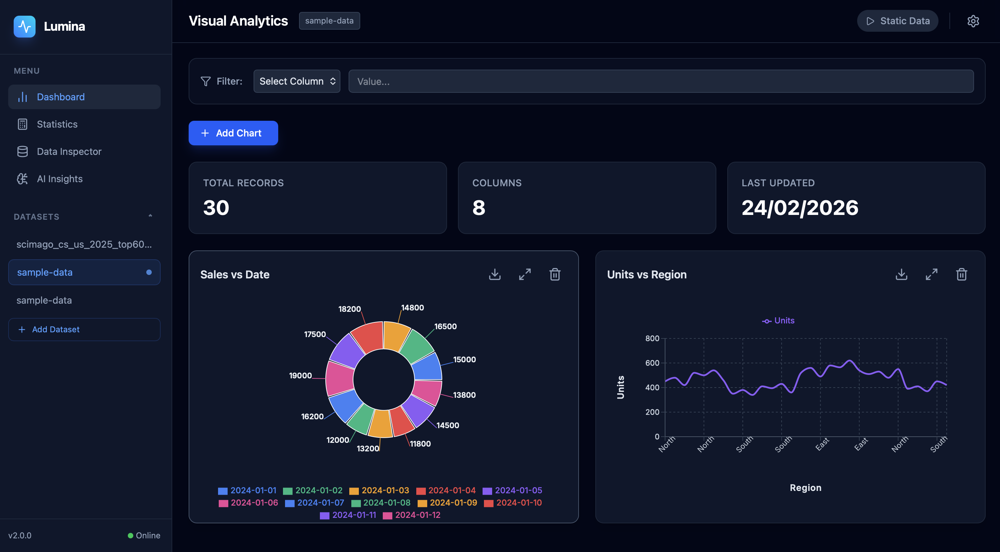

<div align="center">

</div>

# Lumina Analytics Dashboard

A high-performance, interactive data visualization dashboard featuring real-time data updates, dynamic charting capabilities, and statistical analysis.

## Features

- **CSV Data Upload** - Import and visualize your data
- **Multiple Chart Types** - Line, Bar, Area, Scatter, and Pie charts
- **Real-time Updates** - Simulate live data streaming
- **Statistical Analysis** - View key metrics and distributions
- **Data Filtering** - Filter datasets by column values
- **Mobile Responsive** - Works seamlessly on phones, tablets, and desktops
- **AI-Powered Insights** - Get automated data analysis (requires API configuration)
- **Interactive Chat** - Ask questions about your data

## Responsive Design

The dashboard is fully optimized for mobile-first responsive design:
- **Mobile (320px+)** - Full functionality on smartphones
- **Tablet (640px+)** - Optimized layout for tablets
- **Desktop (1024px+)** - Professional full-featured display
- **Large Screens (1280px+)** - Enhanced experience on desktops

For detailed information about responsive features, see [MOBILE_RESPONSIVE_IMPLEMENTATION.md](MOBILE_RESPONSIVE_IMPLEMENTATION.md)

## Run Locally

**Prerequisites:** Node.js (v16 or higher)

1. **Install dependencies:**
   ```bash
   npm install
   ```

2. **(Optional) Set up AI features:**
   - Create a `.env.local` file in the root directory
   - Add your API key: `API_KEY=your_api_key_here`
   - Without this, the dashboard still works for charting and statistics

3. **Start the development server:**
   ```bash
   npm run dev
   ```
   The app will run at `http://localhost:3000`

## Building for Production

```bash
npm run build
npm run preview
```
